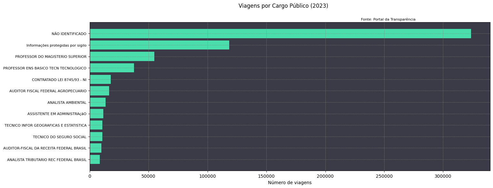

# Análise de Viagens Públicas

Este projeto realiza uma análise consolidada de dados de viagens públicas a partir de um arquivo CSV, gerando uma tabela resumida e um gráfico visual. Ele inclui etapas de leitura, limpeza, transformação e visualização dos dados.

---

## Estrutura do Projeto

### Arquivos de Entrada e Saída
- **Entrada:** Arquivo CSV contendo os dados das viagens.
  - Exemplo: `2023_Viagem.csv`.
- **Saída:**
  - Tabela consolidada salva em formato Excel (`.xlsx`).
  - Gráfico de barras horizontais salvo como imagem (`.png`).

### Estrutura do Código
1. **Leitura e Configuração Inicial:**
   - Define caminhos para entrada e saída dos arquivos.
   - Configura opções de exibição no pandas.
   - Lê o arquivo CSV com encoding adequado e separadores corretos.

2. **Limpeza e Transformação dos Dados:**
   - Calcula despesas totais somando diárias, passagens e outros gastos.
   - Trata valores nulos na coluna `Cargo`.
   - Converte datas e cria novas colunas como:
     - Mês da viagem.
     - Duração da viagem em dias.

3. **Consolidação e Resumo:**
   - Agrupa dados por cargo e calcula métricas como:
     - Despesa média e total.
     - Duração média.
     - Destino mais frequente.
     - Total de viagens.
   - Filtra cargos relevantes com base na proporção de viagens.

4. **Exportação dos Resultados:**
   - Salva a tabela consolidada em Excel.
   - Gera um gráfico de barras horizontais com o número de viagens por cargo.

---

## Requisitos

### Bibliotecas Necessárias
- Python 3.x
- pandas
- matplotlib

Instale as dependências utilizando:
```bash
pip install pandas matplotlib
```

### Estrutura de Arquivos
Certifique-se de que a estrutura de pastas está configurada conforme abaixo:
```
/content/drive/MyDrive/DRIVE/AD/
    |- 2023_Viagem.csv
    |- output/
        |- tabela_2023.xlsx
        |- grafico_2023.png
```

---

## Como Utilizar

1. **Edite os Caminhos:**
   No início do código, atualize as variáveis `caminho_dados`, `caminho_saida_tabela` e `caminho_saida_grafico` conforme sua estrutura de diretórios.

2. **Execute o Código:**
   Rode o script Python para processar os dados e gerar os resultados.

3. **Resultados Gerados:**
   - Um arquivo Excel contendo a tabela consolidada dos dados.
   - Um gráfico de barras horizontais mostrando o número de viagens por cargo relevante.

---

## Exemplos de Saída

### Tabela Consolidada (Excel)
| Cargo           | Despesa Média | Duração Média | Despesas Totais | Destino Mais Frequente | Número de Viagens |
|-----------------|----------------|------------------|-----------------|-----------------------|------------------|
| Diretor         | 1200.50       | 3.5              | 6002.50         | São Paulo            | 5                |
| Analista        | 900.75        | 2.8              | 4503.75         | Rio de Janeiro        | 5                |

### Gráfico de Barras (PNG)


---


